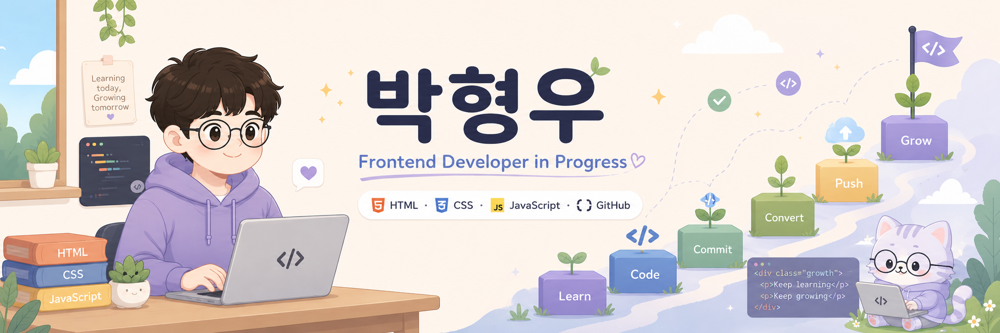

<!--
**dhwmgl12-ux/dhwmgl12-ux** is a ✨ _special_ ✨ repository because its `README.md` (this file) appears on your GitHub profile.

Here are some ideas to get you started:

- 🔭 I’m currently working on ...
- 🌱 I’m currently learning ...
- 👯 I’m looking to collaborate on ...
- 🤔 I’m looking for help with ...
- 💬 Ask me about ...
- 📫 How to reach me: ...
- 😄 Pronouns: ...
- ⚡ Fun fact: ...
-->

# 안녕하세요! 박형우입니다~~ 👋

프론트엔드 개발을 배우고 있으며  
HTML, CSS, JavaScript, Git/GitHub를 중심으로 공부하고 있습니다.

웹디자인과 마케팅 경험을 바탕으로  
사용자가 보기 편하고 이해하기 쉬운 웹사이트를 만드는 것을 목표로 합니다.

---

## 현재 배우는 기술 🛠️

---

## 관심 분야 🎯

- 프론트엔드 개발
- 반응형 웹사이트
- UI/UX
- Figma 와이어프레임
- 웹디자인 기반 퍼블리싱
- Git/GitHub 협업 흐름

---

## GitHub 활동 📊
---

---

## 학습 목표 📚

- HTML/CSS 기본기 탄탄하게 만들기
- JavaScript로 동적인 기능 구현하기
- React 기초 학습하기
- GitHub에 프로젝트 정리하기
- 포트폴리오용 웹사이트 제작하기

---

## 연락처 📬

Email: dhwmgl12@gmail.com
